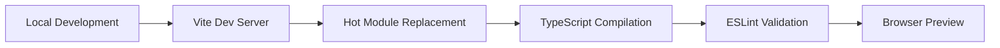
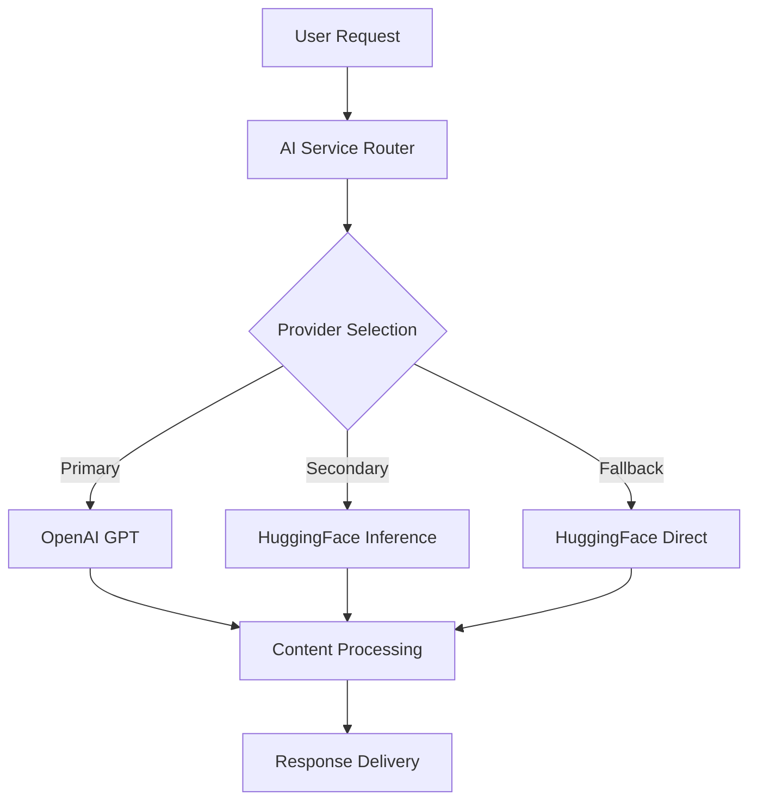
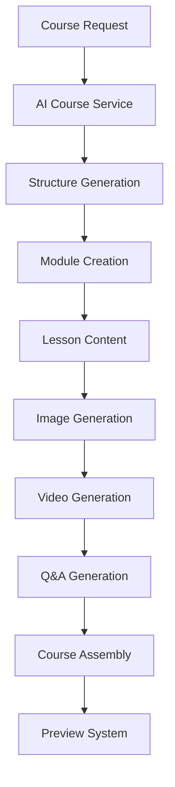

# Creditor UserDash - Complete Tech Stack & Workflow Documentation

## 🏗️ Project Overview

**Creditor UserDash** is a comprehensive educational platform with AI-powered course generation, multi-modal content creation, and advanced learning management capabilities.

---

## 🎯 Current Technology Stack

### **Frontend Architecture**

```
Core Framework: React 18 + TypeScript + Vite
UI Framework: Tailwind CSS + shadcn/ui
State Management: @tanstack/react-query
Routing: React Router DOM v6
```

#### **Key Frontend Dependencies**

- **UI Components**: Complete Radix UI ecosystem (40+ components)
- **Rich Text Editor**: TipTap with extensions (color, image, link, text-align)
- **Animations**: Framer Motion + AOS
- **Charts**: Recharts
- **Forms**: React Hook Form + Zod validation
- **File Handling**: React Image Crop, XLSX
- **Real-time**: Socket.io Client
- **Icons**: Lucide React + React Icons

### **Backend Architecture**

```
Runtime: Node.js + Express
Real-time: Socket.io
Environment: dotenv configuration
Development: Nodemon with hot reload
```

### **AI/ML Integration Stack**

```
Multi-Provider AI System:
├── OpenAI GPT Models (Primary)
├── HuggingFace Inference Client (Streaming)
├── HuggingFace Direct API
├── DeepAI Services
├── Bytez.js (Multi-model support)
└── Qwen Guard (Content moderation)
```

#### **AI Service Capabilities**

- **Text Generation**: GPT-3.5-turbo, Zephyr-7b-beta, GLM-4.6
- **Image Generation**: Stable Diffusion variants, Qwen-image models
- **Content Moderation**: Qwen3Guard with multi-key rotation
- **Course Generation**: Complete curriculum with multimedia
- **Streaming**: Real-time text generation with HuggingFace Inference

### **Development Tools**

```
Build Tool: Vite
Language: TypeScript + JavaScript
Linting: ESLint with React plugins
Styling: PostCSS + Autoprefixer
Package Manager: npm
```

---

## 🔄 Current Workflow Architecture

### **1. Development Workflow**



### **2. AI Content Generation Workflow**



### **3. Course Creation Workflow**



---

## ☁️ Cloud & AWS Requirements

### **Immediate Cloud Needs**

```
Hosting & Deployment:
├── Frontend: Vercel/Netlify (Static hosting)
├── Backend: AWS EC2/ECS (Container deployment)
├── Database: AWS RDS (PostgreSQL/MySQL)
├── File Storage: AWS S3 (Media assets)
└── CDN: AWS CloudFront (Global distribution)
```

### **AI & ML Infrastructure**

```
AI Services:
├── AWS Bedrock (Claude, Titan models)
├── AWS SageMaker (Custom model hosting)
├── OpenAI API (External)
├── HuggingFace Inference Endpoints
└── GPU Instances: AWS P3/G4 (Training/Inference)
```

### **Scalability & Performance**

```
Infrastructure:
├── Load Balancer: AWS ALB
├── Auto Scaling: AWS Auto Scaling Groups
├── Caching: AWS ElastiCache (Redis)
├── Search: AWS OpenSearch
└── Monitoring: AWS CloudWatch + X-Ray
```

### **Security & Compliance**

```
Security Stack:
├── Authentication: AWS Cognito
├── API Gateway: AWS API Gateway
├── Secrets: AWS Secrets Manager
├── SSL/TLS: AWS Certificate Manager
└── WAF: AWS Web Application Firewall
```

---

## 🚀 Future Technology Roadmap

### **Phase 1: Cloud Migration (0-3 months)**

- [ ] **AWS Account Setup** with proper IAM roles
- [ ] **Database Migration** to AWS RDS
- [ ] **File Storage** migration to S3
- [ ] **Backend Deployment** on ECS/Fargate
- [ ] **Frontend Deployment** on Vercel/CloudFront

### **Phase 2: AI Enhancement (3-6 months)**

- [ ] **AWS Bedrock Integration** for advanced models
- [ ] **Custom Model Training** on SageMaker
- [ ] **Vector Database** (Pinecone/AWS OpenSearch)
- [ ] **Real-time AI Streaming** optimization
- [ ] **Content Moderation** enhancement

### **Phase 3: Advanced Features (6-12 months)**

- [ ] **Microservices Architecture** with AWS Lambda
- [ ] **Event-Driven Architecture** with AWS EventBridge
- [ ] **Advanced Analytics** with AWS QuickSight
- [ ] **Mobile App Development** (React Native)
- [ ] **Offline Capabilities** with PWA

### **Phase 4: Enterprise Scale (12+ months)**

- [ ] **Multi-tenant Architecture**
- [ ] **Advanced Security** (SSO, MFA)
- [ ] **Compliance** (GDPR, FERPA, SCORM)
- [ ] **Global CDN** optimization
- [ ] **Enterprise Integrations** (LTI, SAML)

---

## 📊 Resource Requirements

### **Development Team**

```
Current Stack Expertise Needed:
├── Frontend: React/TypeScript developers (2-3)
├── Backend: Node.js/Express developers (2)
├── AI/ML: Python/ML engineers (1-2)
├── DevOps: AWS/Cloud engineers (1)
└── UI/UX: Design specialists (1)
```

### **Infrastructure Costs (Monthly Estimates)**

```
AWS Services:
├── EC2 Instances: $200-500
├── RDS Database: $100-300
├── S3 Storage: $50-150
├── CloudFront CDN: $50-100
├── AI Services: $500-2000
└── Monitoring/Security: $100-200
Total: $1000-3250/month
```

### **Third-Party Services**

```
AI/ML APIs:
├── OpenAI API: $100-500/month
├── HuggingFace Pro: $50-200/month
├── Image Generation: $100-300/month
└── Content Moderation: $50-150/month
```

---

## 🔧 Development Environment Setup

### **Prerequisites**

```bash
Node.js: v18+ (LTS recommended)
npm: v9+
Git: Latest version
VS Code: With extensions (ES7, Tailwind, TypeScript)
```

### **Local Development Commands**

```bash
# Frontend Development
npm install
npm run dev          # Start development server
npm run build        # Production build
npm run preview      # Preview production build

# Backend Development (when implemented)
cd backend
npm install
npm run dev          # Start with nodemon
npm start           # Production start
```

### **Environment Variables Required**

```env
# API Configuration
VITE_API_BASE_URL=your_backend_url

# AI Service Keys
VITE_OPENAI_API_KEY=your_openai_key
VITE_HUGGINGFACE_INFERENCE_API_KEY=your_hf_inference_key
VITE_DEEPAI_API_KEY=your_deepai_key
VITE_BYTEZ_KEY=your_bytez_key

# AWS Configuration (Future)
AWS_ACCESS_KEY_ID=your_aws_access_key
AWS_SECRET_ACCESS_KEY=your_aws_secret_key
AWS_REGION=us-east-1
```

---

## 📈 Performance Metrics & Monitoring

### **Current Monitoring Needs**

- [ ] **API Response Times** (AI services)
- [ ] **Error Rates** (Failed AI requests)
- [ ] **User Engagement** (Course completion)
- [ ] **Resource Usage** (Memory, CPU)
- [ ] **Cost Tracking** (AI API usage)

### **Future Monitoring Stack**

```
Observability:
├── Logs: AWS CloudWatch Logs
├── Metrics: AWS CloudWatch Metrics
├── Tracing: AWS X-Ray
├── Alerts: AWS SNS notifications
└── Dashboards: AWS CloudWatch/Grafana
```

---

## 🔐 Security Considerations

### **Current Security Measures**

- Environment variable management
- API key rotation system
- Content moderation (Qwen Guard)
- Client-side validation (Zod)

### **Future Security Enhancements**

- AWS IAM roles and policies
- API rate limiting
- Input sanitization
- HTTPS everywhere
- Regular security audits
- Compliance frameworks

---

## 📝 Documentation & Knowledge Base

### **Technical Documentation**

- [ ] API documentation (OpenAPI/Swagger)
- [ ] Component library documentation
- [ ] Deployment guides
- [ ] Troubleshooting guides
- [ ] Performance optimization guides

### **User Documentation**

- [ ] User manuals
- [ ] Video tutorials
- [ ] FAQ sections
- [ ] Feature announcements
- [ ] Best practices guides

---

## 🎯 Success Metrics

### **Technical KPIs**

- **Uptime**: 99.9% availability
- **Performance**: <2s page load times
- **AI Response**: <5s generation time
- **Error Rate**: <1% failed requests
- **Scalability**: Support 10k+ concurrent users

### **Business KPIs**

- **User Engagement**: 80%+ course completion
- **Content Quality**: 4.5+ star ratings
- **Cost Efficiency**: <$0.50 per AI-generated lesson
- **Growth**: 50%+ monthly user growth
- **Revenue**: Positive ROI within 12 months

---

_This document serves as a comprehensive guide for understanding the current technology stack and planning future development phases. Use this as a reference for team onboarding, technology decisions, and strategic planning._
